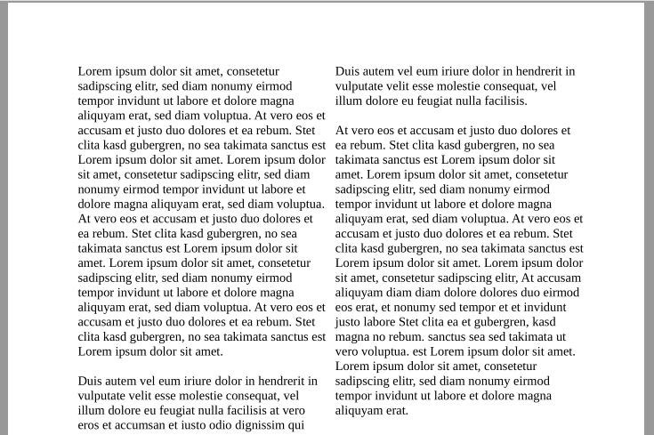
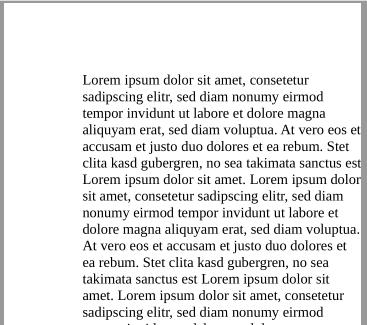
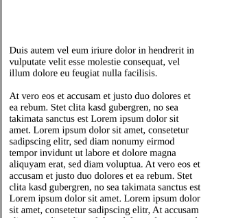
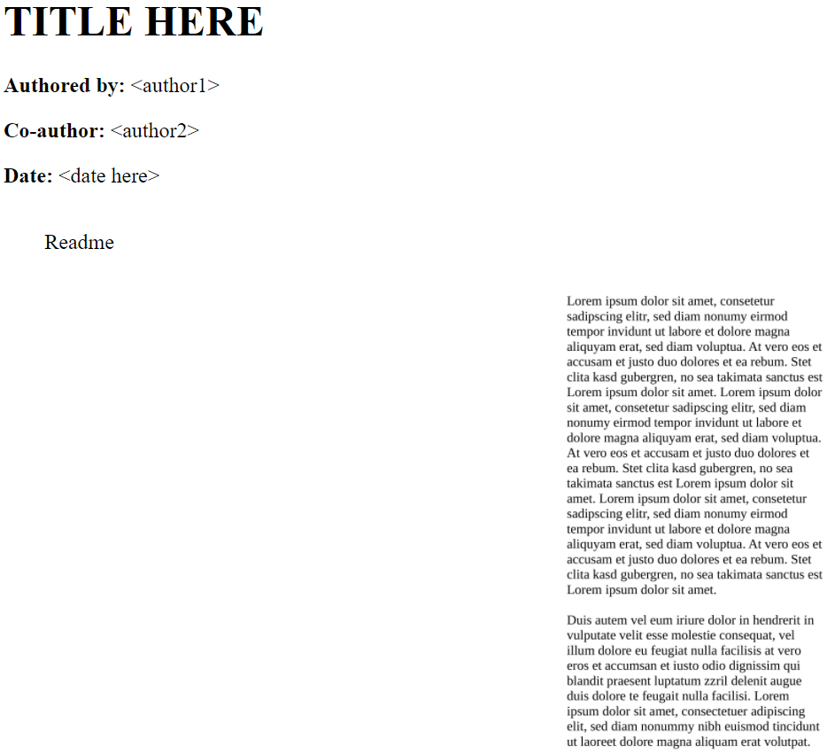

# vivi-paper

This set of tools is aimed to enable reflecting on Research Papers. Since for the most part reading a paper is forgetting a paper. This project is an attempt to put an end to running in this particular hamster wheel: Split pdfs in halves, transform them to images, and add comments next to them to create an annotated HTML view on the paper.

Development was done on Windows. So there are many idiosyncracies, which will prevent these tools to run on Linux - as is. If need be, one can implement the concept on Linux.

List of software dependencies, which must be accessible from anywhere on the command-line:
- GNU Make 3.81
- mutools
- pandoc

## Process

Start of with a pdf which may have two columns.

The command `make.py build` splits the pdf in halve per default. It is possible to not split the pdf in halves. The resulting first pages look as below.

As a final result a HTML is generated.

